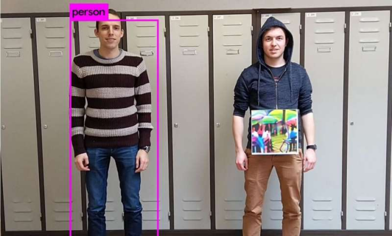

# About
Recently within the past couple of years, adversarial attacks have gained a great amount of popularity in the realm of cyybersecurity. The goal of adversarial attacks is to fool standard machine learning models into misclassifying an input. The most common example of an adversarial attack is an image recognition model mislabelling an image of a panda as a "gibbon"[2]. 

<html>
  <body>

  
<figure>
    
    
<figcaption>Adversarial Example</figcaption>

    </figure>

  </body>
</html>

This slight deviation, although unapparent to the human eye, can be reliably mounted against real-world computer vision systems, making it one of the most practical threat models against these machine learning systems. This type of threat model also can be performed without the attacker having direct access to the model itself. For example a sticker or a patch could fulfill the goal of confusing a classifier into mislabelling an object or image. The goal of our project is to translate robustness of these adversarial attacks into the real-world. Our project looks to fulfill the question of "Can a real-world adversarial attack be reliably mounted such that it is robust to the highly variant and unpredictable visual deformities of physical perturbations?" The focus of our project is to demonstrate the feasibility of such attacks and demonstrate an adversarial patch that is robust despite these conditions. 

<html>
  <body>

  
<figure>
    
    
<figcaption>Physical Adversarial Attack</figcaption>

    </figure>

  </body>
</html> 
