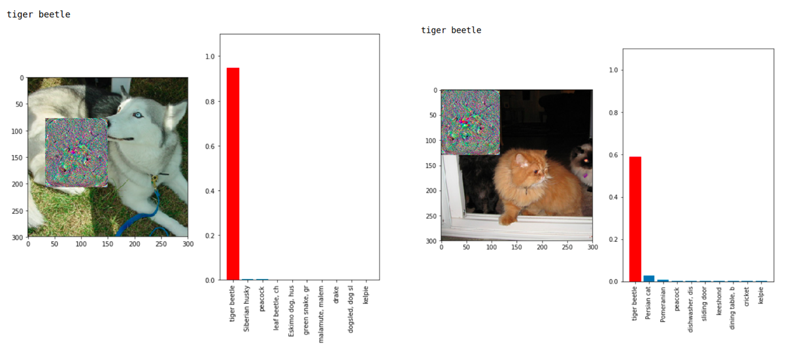
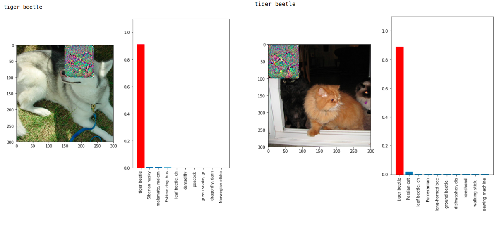
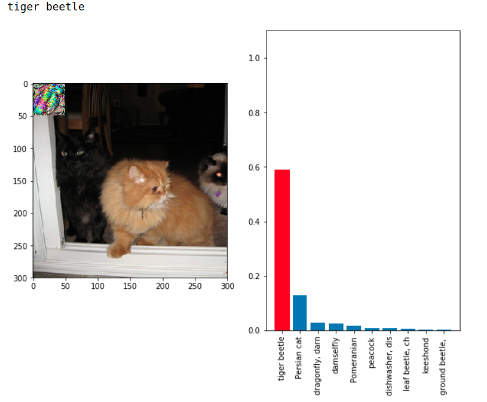

# Results

# Examples

<html>
  <body>

  
<figure>
    
    
<figcaption>Adversarial Patch: 15% of image, random shifts, random vertical/horizontal folds</figcaption>

    </figure>

  </body>
</html>

<html>
  <body>

  
<figure>
    
    
<figcaption>Adversarial Patch: 10% of image, random shifts, random vertical/horizontal folds</figcaption>

    </figure>

  </body>
</html>

<html>
  <body>

  
<figure>
    
    
<figcaption>Adversarial Patch: 3.5% of image, random shifts, random vertical/horizontal folds</figcaption>

    </figure>

  </body>
</html>

# Evaluation
