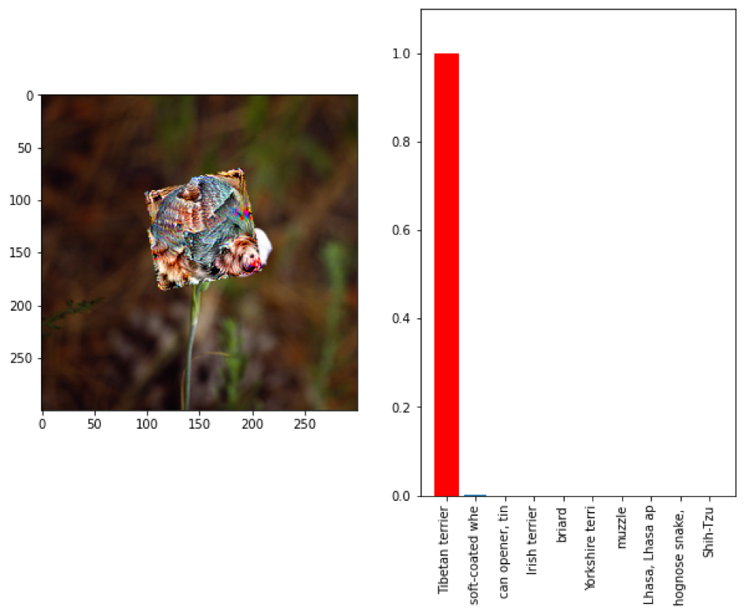
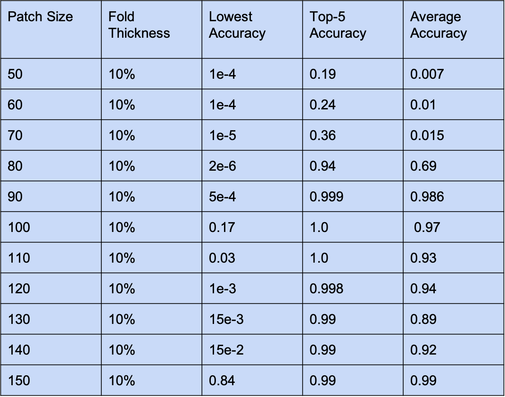
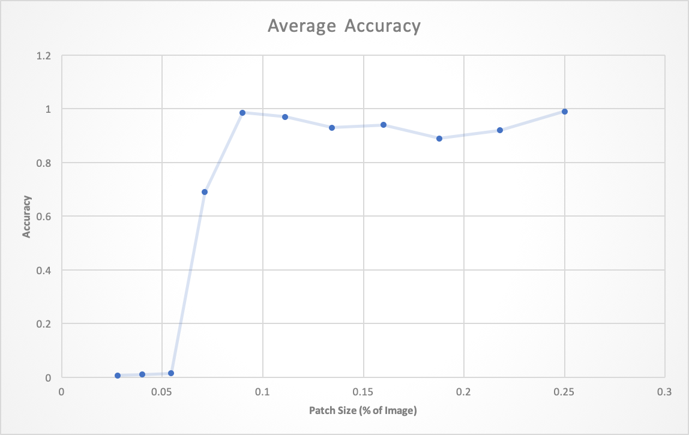
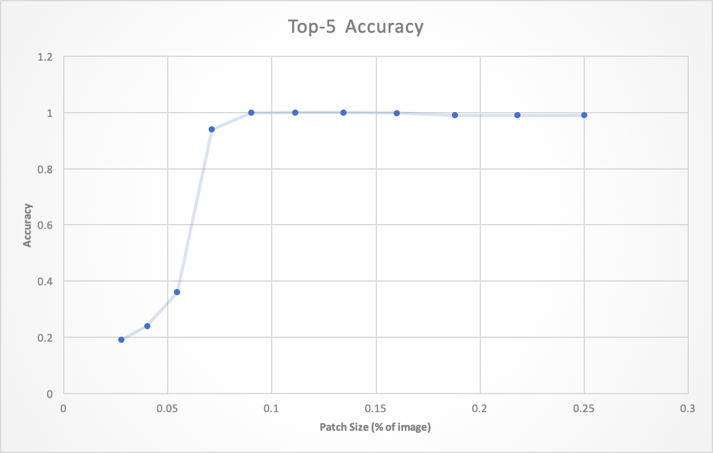
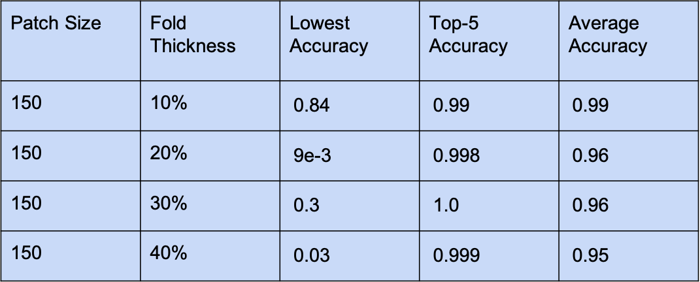

# Metrics
In order to determine how successful our patches were, we collected a concrete set of metrics for comparison. Per patch size and thickness, we measured:
- Lowest accuracy: lowest accuracy measurement of the target class (misclassified class)
- Top-5 accuracy: number of images that produced the target class within its top 5 probabilistic measurements
- Average accuracy: average accuracy measurement of the target class across the entire dataset

For clarification, for the purposes of our project, accuracy is considered the probability that the classifier would mislabel the input image. Additionally, it is important to note that our results are inherently probabilistic due to probabilistic nature of permutations. Therefore, repeated trials of our experiment are likely to yield similar, but not duplicate results. 

# Results
<html>
  <body>

  
<figure>
    
    
<figcaption>Resulting Adversarial Patch with Fold</figcaption>

    </figure>

  </body>
</html>

After demonstrating that the adversarial patch is robust under folds and other transformations, the effect of the patch size with the attack model's rate of success was tested. We trained and tested our adversarial patch of different sizes ranging from 50x50 pixels to 150x150 pixels to determine if there would be any existing correlation betweeen the two.

<html>
  <body>

  
<figure>
    
    
<figcaption>Patch Size vs. Accuracy Metrics with 10% Folds</figcaption>

    </figure>

  </body>
</html>

Based upon the table above, it can be observed that the training for the patches of less than 6% of the image did not converge. However, when training did converge, the results yielded high accuracy metrics. This relationship is graphically shown in the plots below. 

<html>
  <body>

  
<figure>
    
    
<figcaption>Patch Size vs Average Accuracy</figcaption>

    </figure>

  </body>
</html>

<html>
  <body>

  
<figure>
    
    
<figcaption>Patch Size vs Top-5 Accuracy</figcaption>

    </figure>

  </body>
</html>

Based upon the tables and plots above, it was seen that the 150x150 patch demonstrated the highest performance. Therefore, we focused on this patch size and looked to determine the impact of the size of folds on the accuracy metrics of the patch.

<html>
  <body>

  
<figure>
    
    
<figcaption>10%-40% Folds (150x150 patches) vs Accuracy Metrics</figcaption>

    </figure>

  </body>
</html>

For a fold thickness of 20%, a second session was performed due to initially low accuracy metrics. These initial accuracy metrics can be attributed to underfitting i.e. termination of the training session prior to loss convergence. 

# Evaluation
Based upon our results, we demonstrate the feasibility of creating an adversarial patch robust to folds, rotations, translations, and scaling. Overall our adversarial patch demonstrated high accuracy with folds and was able to fool Inceptionv3 at a reliable rate. With our results, came a few observations regarding the relationship between our adversarial patch and the success rate of the model. 

#### Observations: 
- Larger patches led to a higher rate of success as seen by our tables and graphs above
- Patches that were closer to the center of the image led to a higher rate of success
- Accuracy dramatically decreases near picture edges
- Target class was almost always present in the Top-5 probabilistic classifications as seen by the high Top-5 accuracy metrics across most patch sizes
