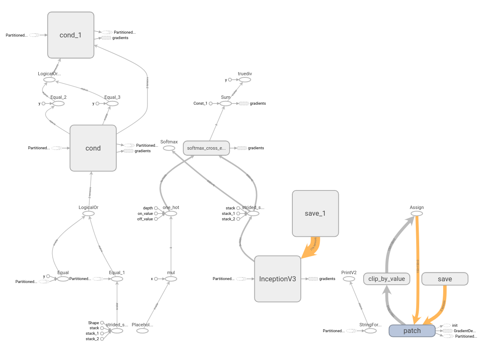

# Platforms
- ImageNet dataset: images are downloaded, labelled, and sorted into training, testing, and validation sets based upon their respectives classes; the training set contained 100 classes with 5 images each, the testing and validation sets each contained 50 classes with 15 images each
- Inceptionv3: image classifier 
- Python/TensorFlow: coding platform for creating image classifier, perturbing images, and mounting adversarial attacks

# Discussion of Adversarial Attack Model
The goal of our algorithm is to create an adversarial patch robust against real-world perturbations such as rotations, scaling, translations, and folds. The pipeline is as follows:

- Multiplying the randomly sampled iteration of the patch
- Random sampling different permutations of the visually deformed adversarial patch
- Applying these different iterations of the adversarial patch to the image
- Calculating the loss and back-propagation

These steps are to be implemented in a single TensorFlow session and executed with varying values for each patch modification function. The different operations are as follows:

- applicator(mapped_patches, original_images): applies the patch to the image
- multiply(single_patch, train_images): creates multiple copies of the patch for the incoming set of images
- shift_rotate(folded_patches, x_shift, y_shift, degrees): shifts the patch the patch vertically/horizontally across the image and rotates the patch given a value of degrees
- fold(array_images, starting, ending, thickness, slope): performs the folding operation to apply to the patch

# Folding Function
In order to keep the goal of the project consistent, the type of folds evaluated within this project were defined stringently into categories of linear or vertical/horizontal folds. Linear folds would be executed given a starting point (in relation to the column), an ending point (in relation to the row), and a thickness. 

<html>
  <body>

  
<figure>
    
    
<figcaption>Example of a Linear Fold</figcaption>

    </figure>

  </body>
</html>

# Proof of Concept
In order to test the validity and feasibility of our approach, a proof of concept model was performed with a classic gradient descent training algorithm. Despite a strong permutation, the adversarial patch could still fool the classifier which implicitly demonstrates the functionality of other smaller and variant perturbations. Therefore a simple yet large fold was applied onto an adversarial patch and fed into our pipeline. After collecting our results, we observed that the distorted patch still produced the expected outcome of fooling the classifier. Therefore, we can proceed into creating a patch with smaller yet highly variant and unpredictable perturbations that could still lead to the misclassification of inputs. 

<html>
  <body>

  
<figure>
    
    
<figcaption>Proof of Concept</figcaption>

    </figure>

  </body>
</html>

# Pipeline
<html>
  <body>

  
<figure>
    
    
<figcaption>Pipeline for Creating Robust Adversarial Patch</figcaption>

    </figure>

  </body>
</html>

# Tensorboard
<html>
  <body>

  
<figure>
    
    
<figcaption>Tensorboard Graph</figcaption>

    </figure>

  </body>
</html>
