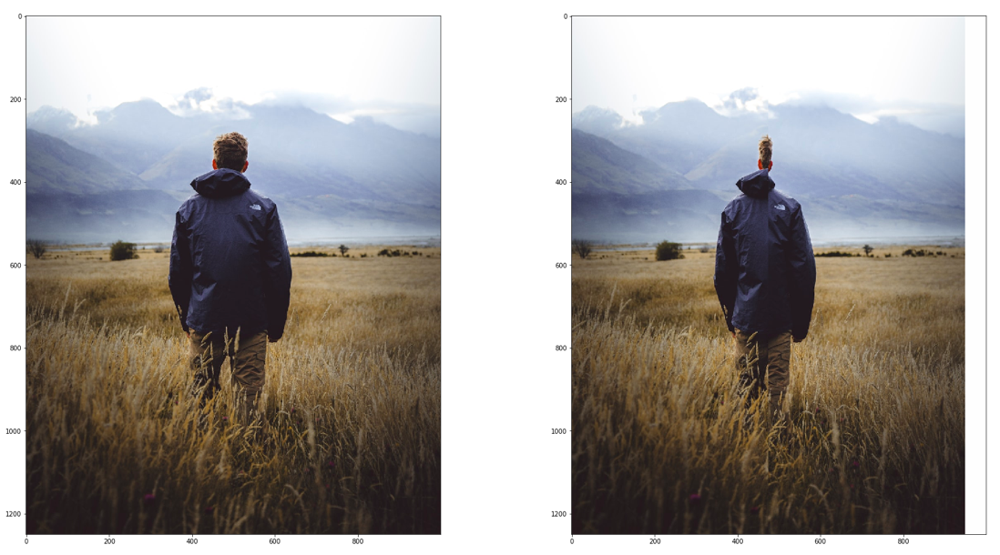
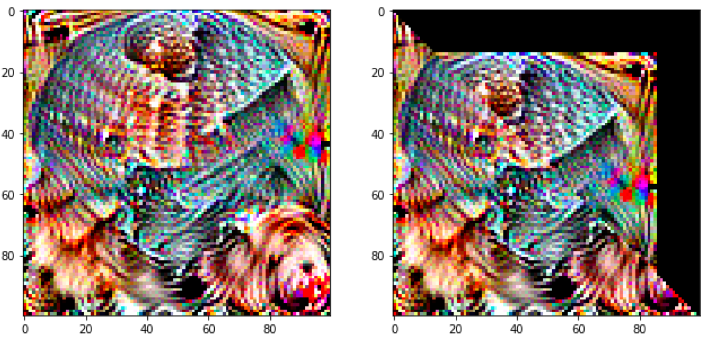
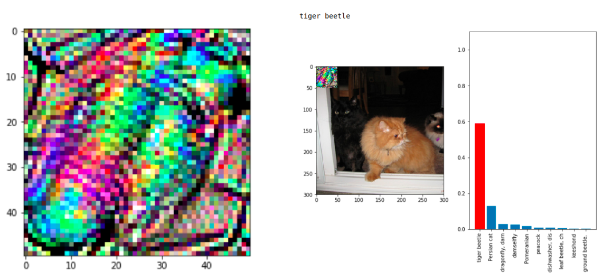
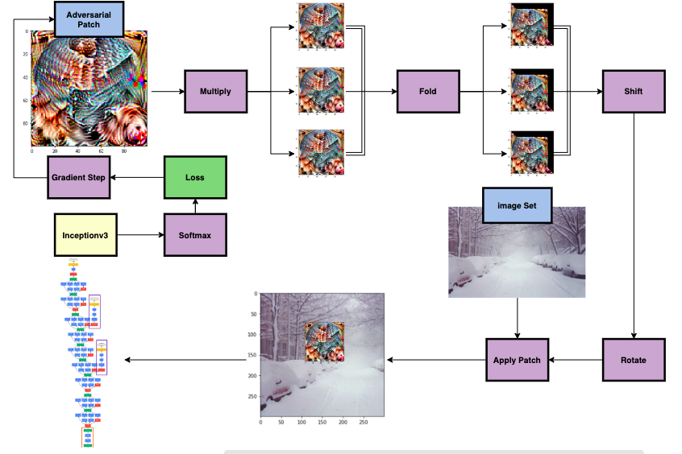

# Platforms
- ImageNet dataset: images are downloaded, labelled, and sorted into training, testing, and validation sets based upon their respectives classes; the training set contained 100 classes with 5 images each, the testing and validation sets each contained 50 classes with 15 images each
- Inceptionv3: image classifier 
- Python/TensorFlow: coding platform for creating image classifier, perturbing images, and mounting adversarial attacks

# Discussion of Adversarial Attack Model
The goal of our model is to adjust the classifier's loss to create an adversarial patch robust against real-world perturbations such as rotations, scaling, translations, and folds. The pipeline is as follows:

- Random sampling different permutations of the visually deformed adversarial patch
- Applying these different iterations of the adversarial patch to the image
- Multiplying the randomly sampled iteration of the patch
- Gathering, collecting, and adjusting for the resulting loss 

These steps are to be implemented in a single TensorFlow session and executed with varying values for each patch modification function. The different operations are as follows:

- applicator(mapped_patches, original_images): applies the patch to the image
- multiply(single_patch, train_images): creates multiple copies of the patch for the incoming set of images
- shift_rotate(folded_patches, x_shift, y_shift, degrees): shifts the patch the patch vertically/horizontally across the image and rotates the patch given a value of degrees
- fold(array_images, starting, ending, thickness, slope): performs the folding operation to apply to the patch

# Folding Function
In order to keep the goal of the project consistent, the type of folds evaluated within this project were defined stringently into categories of linear or vertical/horizontal folds. Linear folds would be executed given a starting point (in relation to the column), an ending point (in relation to the row), and a thickness. The pixels within the range of thickness along this starting and ending point would then be removed and the remaining pixels would be appended by the row. The starting column of removal of each row would alter depending on the slope provided into the function. Similarly, a vertical/horizontal fold would consist of a starting point, an ending point, and a thickness. The x coordinates of the starting and ending points will be the same for a vertical fold, and the y coordinates of the starting and ending points will be the same for a horizontal fold.

```
# input parameters: start(x,y), end(x,y), thickness, images, slope (calculated from start and end coordinates)
for i from start_x to end_x:
  # Perform row by row evaluation 
  # Update new start_y with slope 
  Obtain left columns of the row from the fold from (start_y)
  Obtain right columns of the row from the fold from (start_y + thickness)
  Obtain tf.tensor for fill
  new_folded_row = Concatenate [left columns, fill, right columns] along axis=2
  
  # Append the newly folded row into image
  Obtain top rows prior to i 
  Obtain bottom rows after i
  new_folded_images = Concatenate [top rows, new_folded_row, bottome rows] along axis=1
```

<!--<html>
  <body><p>
  <center><figure>
    
    <center><figcaption>Example of a Vertical Fold</figcaption></center>
    </figure></center></p>
  </body>
</html>-->

<html>
  <body><p>
  <center><figure>
    
    <center><figcaption>Example of a Linear Fold</figcaption></center>
    </figure></center>
  <center><figure>
    
    <center><figcaption>Fold Example 1</figcaption></center>
    </figure></center>
  <center><figure>
    
    <center><figcaption>Fold Example 2</figcaption></center>
    </figure></center>
  </body>
</html>

# Proof of Concept
In order to test the validity and feasibility of our approach, a proof of concept model was performed with a vanilla training algorithm. The goal is to demonstrate that a strong permutation of the adversarial patch could still achieve the goal of fooling the classifier into a misclassification which implicitly demonstrates the functionality of other smaller and variant perturbations. Therefore a simple yet large fold was applied onto an adversarial patch and fed into our pipeline. After collecting our results, we observed that the distorted patch still produced the expected outcome of fooling the classifier. Therefore, we can proceed into creating a patch with smaller yet highly variant and unpredictable perturbations that could still lead to the misclassification of inputs. 

<html>
  <body><p>
  <center><figure>
    
    <center><figcaption>Proof of Concept</figcaption></center>
    </figure></center></p>
  </body>
</html>

# Pipeline
<html>
  <body><p>
  <center><figure>
    
    <center><figcaption>Pipeline for Creating Robust Adversarial Patch</figcaption></center>
    </figure></center></p>
  </body>
</html>

# Tensorboard
